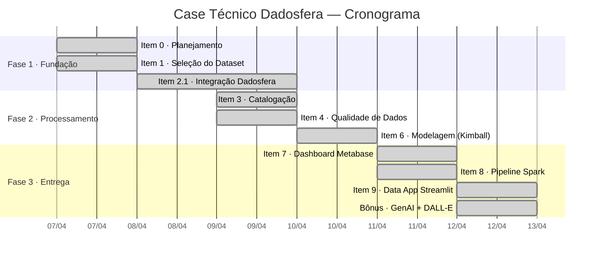
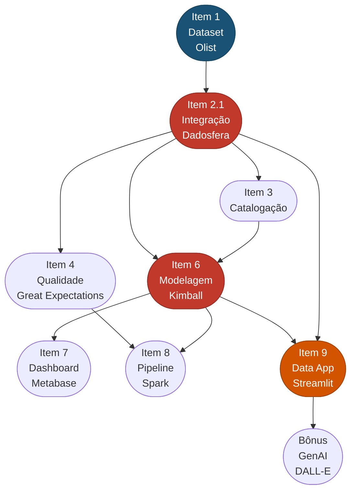

# Item 0 - Planejamento Ágil

## Visão geral do projeto

**Cliente:** Empresa de e-commerce brasileira  
**Objetivo:** Construir uma POC de plataforma de dados centralizada na Dadosfera, entregando análises descritivas e geração de features com IA  
**Dataset:** Olist E-commerce Public Dataset (112.650 registros)  
**Responsável:** Athos Johann  
**Período:** Abril 2026

---

## Gantt Chart — Cronograma de Execução



---

## Fluxograma de Interdependências



> **Legenda:** Vermelho = pontos críticos do caminho crítico | Laranja = entrega dependente | Azul = ponto de entrada

### Caminho crítico

```
Item 1 → Item 2.1 → Item 6 → Item 7 → Item 9 → Bônus
```

Os itens **2.1** (integração) e **6** (modelagem) são os gargalos do projeto: todos os demais dependem deles direta ou indiretamente. Um atraso em qualquer um desses dois impacta a entrega final.

---

## Kanban Board — Status das Entregas

| To Do | In Progress | Done |
|---|---|---|
| — | — | Item 1 · Dataset |
| — | — | Item 2.1 · Integração |
| — | — | Item 3 · Catalogação |
| — | — | Item 4 · Qualidade + CDM |
| — | — | Item 6 · Modelagem Kimball |
| — | — | Item 7 · Dashboard Metabase |
| — | — | Item 8 · Pipeline Spark |
| — | — | Item 9 · Data App Streamlit |
| — | — | Bônus · GenAI + DALL-E |

---

## Análise de Riscos (PMBOK)

| ID | Risco | Categoria | Probabilidade | Impacto | Nível | Resposta |
|---|---|---|---|---|---|---|
| R1 | Módulo de Inteligência bloqueado na Dadosfera (plano Trial) | Técnico | Alta | Alto | **Crítico** | Substituído por Apache Spark no Google Colab — bônus atingido |
| R2 | Chave de API OpenAI exposta ou inválida | Segurança | Média | Alto | **Alto** | Uso de Streamlit Secrets; não versionamento da chave; regeneração imediata em caso de exposição |
| R3 | Inconsistências no dataset (nulos, duplicatas, valores inválidos) | Qualidade | Baixa | Médio | **Médio** | 8 Expectations definidas no Great Expectations (Item 4); resultado: 0 inconsistências |
| R4 | Falha no deploy do Data App (caminho relativo de arquivo) | Técnico | Média | Médio | **Médio** | Uso de `os.path.dirname(__file__)` para caminho absoluto — resolvido |
| R5 | Dataset excede limite de tamanho do repositório GitHub | Infraestrutura | Baixa | Baixo | **Baixo** | CSV de ~10 MB está dentro do limite de 100 MB do GitHub |
| R6 | Atraso na propagação de Secrets no Streamlit Cloud | Técnico | Baixa | Baixo | **Baixo** | Aguardar até 1 min após salvar; reboot do app se necessário |

### Matriz de risco

```
Impacto
  Alto  │ R2 (M)  │ R1 (A)  │
  Médio │ R3 (B)  │ R4 (M)  │
  Baixo │ R5 (B)  │ R6 (B)  │
        └─────────┴─────────┘
         Baixa     Média/Alta
              Probabilidade
```

---

## Estimativa de Custos

| Recurso | Tipo | Plano utilizado |
|---|---|---|
| Dadosfera | Plataforma de dados | Trial gratuito |
| OpenAI API — DALL-E 3 | IA Generativa | Pay-as-you-go |
| Streamlit Community Cloud | Deploy do Data App | Free tier |
| Google Colab | Execução de notebooks | Free tier |
| GitHub | Versionamento | Free tier |
| Metabase (via Dadosfera) | Visualização | Incluso no Trial |
| Olist Dataset (Kaggle) | Dados | Open license (CC BY-NC-SA 4.0) |

> A Dadosfera elimina o custo de infraestrutura — não há serviços de ingestão, armazenamento, transformação ou BI para provisionar separadamente, o que torna a solução significativamente mais econômica em comparação a montar o equivalente com serviços de cloud individuais.

---

## Alocação de Recursos

| Recurso | Papel | Itens de responsabilidade | Dedicação |
|---|---|---|---|
| **Athos Johann** | Data Engineer & Developer | Todos os itens | 100% |
| Dadosfera | Plataforma (Collect, Catalog, Analyze) | 2.1, 3, 7 | Ferramenta |
| Apache Spark (Colab) | Engine de processamento distribuído | 8 | Ferramenta |
| Great Expectations | Framework de qualidade | 4 | Biblioteca |
| OpenAI API (DALL-E 3) | Geração de imagens com IA | Bônus | API externa |
| Metabase | Business Intelligence | 7 | Ferramenta |
| Streamlit Cloud | Deploy do Data App | 9, Bônus | Plataforma |
| GitHub | Versionamento e entrega | Todos | Infraestrutura |

---

## Pontos críticos e decisões de projeto

| Ponto | Decisão tomada | Justificativa |
|---|---|---|
| Módulo Process/Inteligência indisponível | Implementar pipeline com PySpark em Colab | Manteve o bônus de Spark; não bloqueou a entrega do Item 8 |
| Dataset sem atributos textuais de produto | Usar features numéricas (preço, frete) para similaridade | Cosine similarity com features normalizadas cobre o requisito do Bônus |
| Chave API exposta no git | Revogar chave e usar Streamlit Secrets | Boa prática de segurança; sem credenciais no código |
| Apenas 1 tabela do dataset Olist | `olist_order_items_dataset` com 112.650 registros | Suficiente para cobrir todos os itens; schema limpo e bem documentado |
