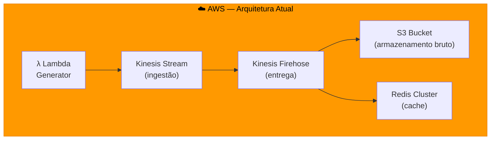
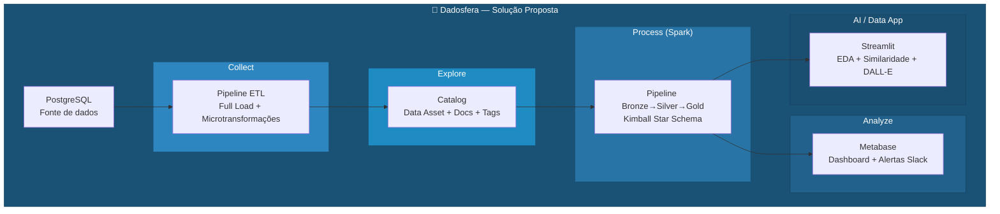
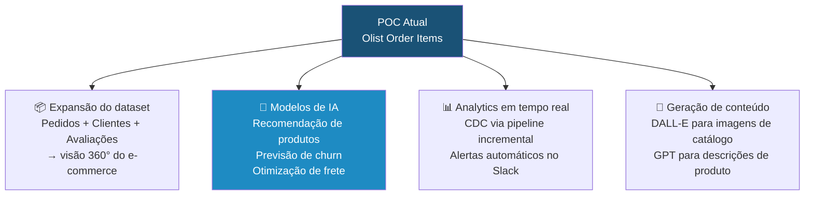
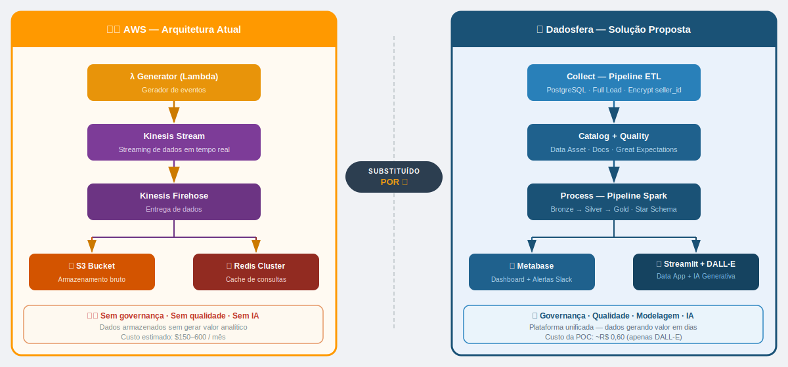

# Item 10 - Apresentação do Case

> **Posição:** Especialista de Dados — Dadosfera  
> **Contexto:** Reunião técnica com equipe de e-commerce após kickoff bem-sucedido  
> **Objetivo:** Demonstrar que a Dadosfera é o caminho mais rápido entre dados e valor

---

## 1. Problema central a ser resolvido

A arquitetura AWS atual do cliente (Lambda → Kinesis → Firehose → S3/Redis) resolve o problema de **ingestão e armazenamento**, mas cria novos problemas:

| Dor | Impacto no negócio |
|---|---|
| Dados fragmentados em S3 e Redis sem governança | Analistas não encontram os dados certos |
| Sem catálogo — ninguém sabe o que cada campo significa | Retrabalho e decisões baseadas em dados errados |
| Sem camada de qualidade | Dados inconsistentes chegam nos dashboards |
| Dashboards e pipelines em ferramentas separadas | Alto custo de manutenção e integração |
| Zero capacidade de IA/ML integrada ao fluxo | Oportunidades de personalização perdidas |

**Em resumo:** o cliente tem infraestrutura de dados mas não tem uma **plataforma de dados**. Esses são conceitos diferentes.

---

## 2. Diagrama — AWS atual vs Dadosfera

### Arquitetura atual (AWS)

**Problemas:** nenhuma camada de catálogo, qualidade, modelagem ou visualização integrada. Cada nova necessidade exige um serviço AWS adicional — custo e complexidade crescem juntos.

---

### Solução proposta — Dadosfera

### Mapeamento direto: AWS → Dadosfera

| Componente AWS | Substituto Dadosfera | Ganho |
|---|---|---|
| Lambda Generator | Pipeline Collect (PostgreSQL connector) | Sem código de infraestrutura |
| Kinesis Stream | Pipeline scheduling (Full Load / CDC) | Configuração visual, sem SDK |
| Kinesis Firehose | Microtransformações (Encrypt, Transform) | Transformação declarativa |
| S3 Bucket | Data Lake nativo (Bronze/Silver/Gold) | Zonas já organizadas |
| Redis Cluster | Metabase + cache de queries | BI integrado, sem Redis para gerir |
| ❌ (não existia) | Catalog com dicionário de dados | Governança zero → governança completa |
| ❌ (não existia) | Great Expectations integrado | Qualidade de dados rastreável |
| ❌ (não existia) | Data App + DALL-E | IA gerando valor direto ao negócio |

---

## 3. POC construída — todos os ativos

| Item | Entregável | Link |
|---|---|---|
| 0 | Planejamento PMBOK (Gantt, riscos, custos) | [item_0_planejamento.md](item_0_planejamento.md) |
| 1 | Dataset Olist — 112.650 registros | [item_1_dataset.md](item_1_dataset.md) |
| 2.1 | Pipeline PostgreSQL → Dadosfera + Encrypt seller_id | [item_2.1_integracao.md](item_2.1_integracao.md) |
| 3 | Data asset catalogado via API | [item_3_catalogacao.md](item_3_catalogacao.md) |
| 4 | 8 Expectations (0 falhas) + mapeamento CDM | [item_4_qualidade.md](item_4_qualidade.md) |
| 6 | Star Schema Kimball + 2 views analíticas | [item_6_modelagem.md](item_6_modelagem.md) |
| 7 | Dashboard Metabase — 5 tipos de visualização + alerta Slack | [item_7_visualizacao.md](item_7_visualizacao.md) |
| 8 | Pipeline ETL Spark (Bronze→Silver→Gold) | [item_8_pipeline.md](item_8_pipeline.md) |
| 9 | Data App Streamlit (EDA + Seller + Similaridade) | [item_9_data_app.md](item_9_data_app.md) |
| Bônus | Gerador de apresentação de produto com DALL-E 3 | [item_bonus_genai.md](item_bonus_genai.md) |

**Data App ao vivo:** [athosjohannddftech042026.streamlit.app](https://athosjohannddftech042026-bhnzunzfetvedwqddt4qnz.streamlit.app/)

---

## 4. Por que a Dadosfera é tecnicamente mais viável

### 4.1 Velocidade de entrega

Com a arquitetura AWS, montar o equivalente ao que foi construído neste case exigiria:
- Configurar IAM roles, VPCs, Lambda functions
- Implementar Glue ou EMR para transformações
- Integrar QuickSight ou Tableau para visualização
- Desenvolver APIs customizadas para o Data App

Com a Dadosfera, o mesmo resultado foi atingido **em uma semana**, por um único profissional, sem provisionamento de infraestrutura.

### 4.2 Custo total de ownership

| | AWS (estimado/mês) | Dadosfera |
|---|---|---|
| Ingestão | Kinesis: ~$15–50 | Incluso |
| Armazenamento | S3: ~$23/TB | Incluso |
| Transformação | Glue/EMR: ~$100–500 | Incluso |
| BI | QuickSight: $18/usuário | Metabase incluso |
| Governança | AWS Glue Catalog: ~$1/10k objetos | Incluso |
| **Total estimado** | **$150–600+/mês** | **Plano único** |

### 4.3 Curva de aprendizado

A Dadosfera foi operada neste case com um único profissional sem certificações AWS. A interface visual do módulo Collect, Catalog e Analyze reduz drasticamente a barreira de entrada.

---

## 5. Oportunidades e ganhos futuros

| Oportunidade | Impacto esperado |
|---|---|
| Integrar tabelas de clientes e avaliações | Análise de NPS, churn e LTV |
| Treinar modelo de recomendação | Aumento do ticket médio por sugestão de produtos relacionados |
| Pipeline de features com LLM | Categorização automática de produtos por descrição |
| DALL-E em escala para catálogo | Geração automatizada de imagens de produto para sellers sem foto |
| Alertas de KPI em tempo real | Reação mais rápida a quedas de conversão |

---

## Evidências

### Diagrama de substituição arquitetural

### Vídeo de apresentação

> Link do YouTube (unlisted): _adicionar após gravação_
