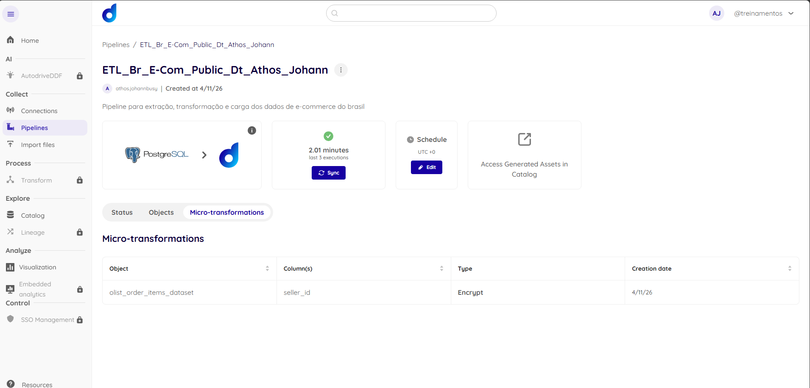

# Item 2.1 - Integração dos dados na Dadosfera

## Dataset utilizado

Foi utilizada a base pública **[Olist E-commerce Dataset](https://www.kaggle.com/datasets/olistbr/brazilian-ecommerce)**, com volume superior a 100.000 registros, aderente ao cenário de e-commerce proposto no case.

A base contempla dados reais de pedidos, itens, vendedores, clientes e avaliações do marketplace brasileiro Olist — cobrindo todo o ciclo de uma transação de e-commerce.

## Pipeline de Integração

A integração foi realizada no módulo **Collect** da Dadosfera por meio de uma pipeline conectada a uma fonte **PostgreSQL**, com objeto configurado para carga **Full Load**.

**Conexão:** [postgresql-1.0.0 (PostgreSQL)](https://app.dadosfera.ai/en-US/collect/connections/1775945377062_ahlq7ivb_postgresql-1.0.0)

**Pipeline:** [ETL_Br_E-Com_Public_Dt_Athos_Johann](https://app.dadosfera.ai/en-US/collect/pipelines/ea6717c9-2da0-4a47-b9a4-c169aeccc5a8)

Ações realizadas:

- Conexão `postgresql-1.0.0` criada no módulo Collect apontando para a fonte PostgreSQL;
- Pipeline `ETL_Br_E-Com_Public_Dt_Athos_Johann` criada e vinculada à conexão;
- Objeto `olist_order_items_dataset` criado com carga Full Load;
- Sincronização executada com sucesso;
- Base preparada para posterior catalogação e exploração analítica.

## Microtransformação (Bônus)

Como bônus, foi aplicada uma **microtransformação de criptografia (Encrypt)** sobre a coluna `seller_id` do objeto `olist_order_items_dataset`.

O campo `seller_id` é um identificador que pode ser associado a dados cadastrais do vendedor, sendo classificado como **PII (Personally Identifiable Information)**. A criptografia garante a anonimização desse dado já na camada de ingestão, seguindo boas práticas de privacidade e proteção de dados.

## Evidências

### Pipeline criada no módulo Collect

> Print da aba **Micro-transformations** da pipeline `ETL_Br_E-Com_Public_Dt_Athos_Johann`, mostrando a transformação do tipo **Encrypt** aplicada à coluna `seller_id` do objeto `olist_order_items_dataset`.
