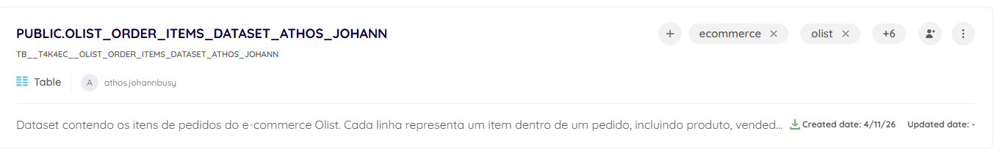
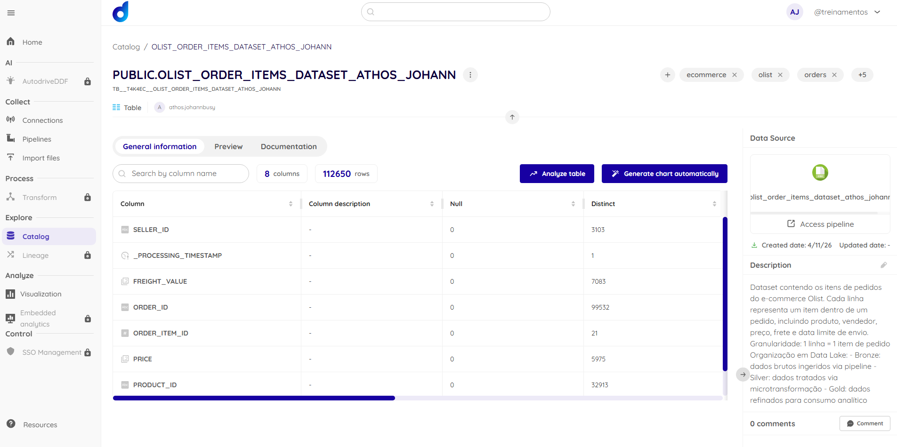
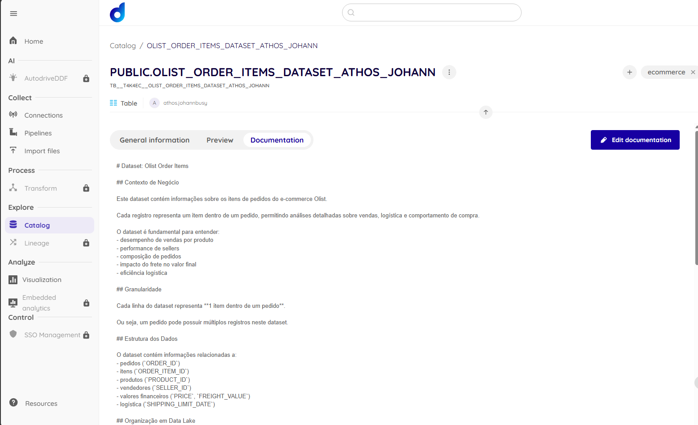
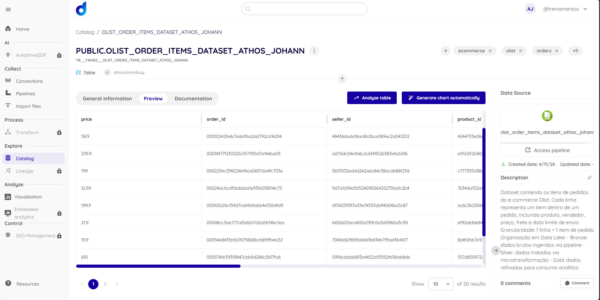

# Item 3 - Exploração e Catalogação dos Dados

## Data Asset catalogado

**[PUBLIC.OLIST_ORDER_ITEMS_DATASET_ATHOS_JOHANN](https://app.dadosfera.ai/en-US/catalog/data-assets/4a5c4b00-8b56-4415-b094-38b5dafd5405)**

O data asset foi catalogado no módulo **Catalog** da Dadosfera, representando a tabela `olist_order_items_dataset` carregada via pipeline no item 2.1.

## Processo de catalogação

A catalogação foi realizada de forma programática por meio da **API REST da Dadosfera (Maestro API)**, utilizando o notebook:

**[notebooks/item_3/Catalog_API_Dadosfera.ipynb](../notebooks/item_3/Catalog_API_Dadosfera.ipynb)**

### Etapas executadas via API

| Etapa | Endpoint | Descrição |
|---|---|---|
| Autenticação | `POST /auth/sign-in` | Obtenção do token de acesso |
| Listagem do catálogo | `GET /catalog` | Verificação dos data assets disponíveis |
| Consulta do data asset | `GET /catalog/data-asset/{id}` | Leitura do estado atual do asset |
| Atualização de metadados | `PUT /catalog/data-asset/{id}` | Adição de nome, descrição e tags |
| Preview dos dados | `GET /catalog/data-asset/{id}/preview` | Validação visual dos registros |
| Verificação de colunas | `GET /catalog/data-asset/{id}/columns-metadata` | Inspeção dos metadados por coluna |
| Documentação | `POST /catalog/data-asset/{id}/docs` | Adição de documentação de negócio ao asset |

### Metadados registrados

- **Nome:** `PUBLIC.OLIST_ORDER_ITEMS_DATASET_ATHOS_JOHANN`
- **Descrição:** contexto de negócio do dataset, origem Olist e significado de cada campo
- **Documentação:** seção de contexto de negócio, dicionário de dados e observações sobre PII (`seller_id` criptografado)

## Evidências

### Página do data asset no Catálogo

### Colunas e metadados

### Documentação adicionada

### Preview dos dados

