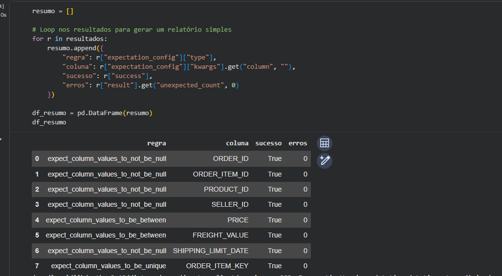

# Item 4 - Qualidade de Dados

## Ferramenta utilizada

**[Great Expectations](https://greatexpectations.io/)** — biblioteca Python para definição e execução de regras de qualidade (Expectations) sobre datasets.

O relatório foi gerado programaticamente via notebook:

**[notebooks/item_4/Data_Quality.ipynb](../notebooks/item_4/Data_Quality.ipynb)**

## Regras de qualidade aplicadas

Foram definidas **8 Expectations** sobre o dataset `olist_order_items_dataset`, cobrindo nulidade, validade de valores e unicidade de chave composta.

| Regra (Expectation) | Coluna | Resultado | Erros |
|---|---|---|---|
| `expect_column_values_to_not_be_null` | `ORDER_ID` | Passou | 0 |
| `expect_column_values_to_not_be_null` | `ORDER_ITEM_ID` | Passou | 0 |
| `expect_column_values_to_not_be_null` | `PRODUCT_ID` | Passou | 0 |
| `expect_column_values_to_not_be_null` | `SELLER_ID` | Passou | 0 |
| `expect_column_values_to_be_between` | `PRICE` | Passou | 0 |
| `expect_column_values_to_be_between` | `FREIGHT_VALUE` | Passou | 0 |
| `expect_column_values_to_not_be_null` | `SHIPPING_LIMIT_DATE` | Passou | 0 |
| `expect_column_values_to_be_unique` | `ORDER_ITEM_KEY` | Passou | 0 |

> `ORDER_ITEM_KEY` é uma chave composta criada como concatenação de `ORDER_ID` + `ORDER_ITEM_ID`, usada para verificar duplicidade em nível de item de pedido.

## Métricas gerais

| Métrica | Valor |
|---|---|
| Total de linhas | 112.650 |
| Nulos em `ORDER_ID` | 0 |
| Nulos em `PRODUCT_ID` | 0 |
| Nulos em `SELLER_ID` | 0 |
| Preços inválidos (`PRICE` ≤ 0) | 0 |
| Fretes inválidos (`FREIGHT_VALUE` < 0) | 0 |
| Duplicidades em `ORDER_ITEM_KEY` | 0 |

**Resultado geral: 8/8 regras aprovadas — dataset sem inconsistências detectadas.**

## Mapeamento CDM (Bônus)

Como bônus, foi realizado o mapeamento das colunas do dataset para o **Common Data Model (CDM)**, alinhando a nomenclatura ao padrão de entidades de comércio do CDM da Microsoft.

| Campo original | Campo CDM | Descrição |
|---|---|---|
| `ORDER_ID` | `OrderId` | Identificador do pedido |
| `ORDER_ITEM_ID` | `LineNumber` | Número da linha do pedido |
| `PRODUCT_ID` | `ProductId` | Identificador do produto |
| `SELLER_ID` | `VendorId` | Identificador do vendedor |
| `PRICE` | `UnitPrice` | Preço unitário |
| `FREIGHT_VALUE` | `ShippingCost` | Custo de frete |
| `SHIPPING_LIMIT_DATE` | `ShipDate` | Data limite de envio |

O mapeamento posiciona o dataset dentro da entidade **SalesOrderLine** do CDM.

## Arquivos gerados

| Arquivo | Descrição |
|---|---|
| [assets/item_4/relatorio_quality.csv](../assets/item_4/relatorio_quality.csv) | Resultado de cada Expectation aplicada |
| [assets/item_4/metricas_quality.csv](../assets/item_4/metricas_quality.csv) | Métricas gerais do dataset |
| [assets/item_4/mapeamento_cdm.csv](../assets/item_4/mapeamento_cdm.csv) | Mapeamento das colunas para o CDM |

## Evidências

### Execução das Expectations no notebook

