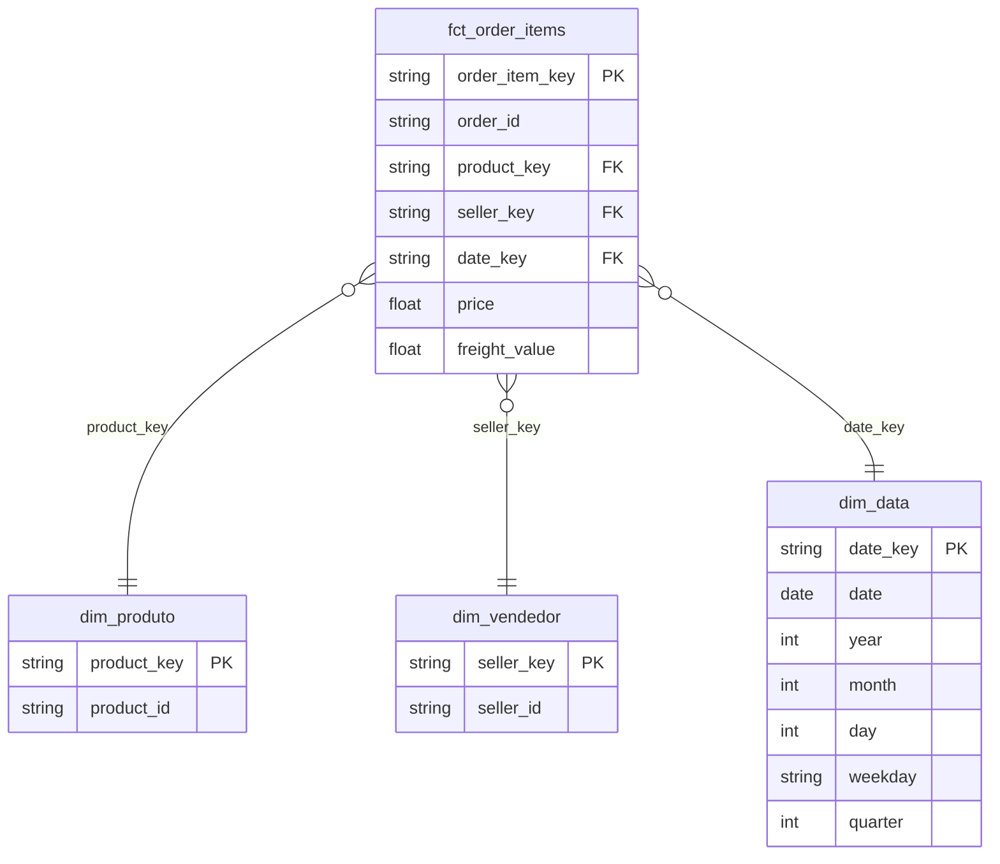
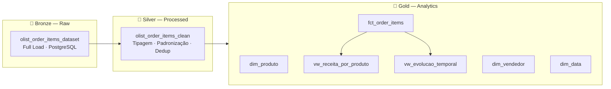

# Item 6 - Modelagem de Dados

## Metodologia escolhida: Kimball (Star Schema)

### Justificativa

| Critério | Decisão |
|---|---|
| Fonte de dados | Tabela única e flat (`olist_order_items_dataset`) |
| Objetivo de consumo | Dashboards analíticos (item 7) e data apps (item 9) |
| Perfil do consumidor | Analistas de negócio e ferramentas de BI |
| Complexidade | Baixa — sem múltiplos sistemas de origem a integrar |

O **modelo Kimball** foi escolhido por ser otimizado para leitura analítica, com joins simples entre uma tabela fato e suas dimensões. Data Vault seria a escolha ideal para múltiplas fontes heterogêneas com rastreabilidade histórica complexa — o que não é o caso aqui. O objetivo do cliente é agilidade analítica com menor custo, o que favorece o Star Schema.

---

## Modelo Star Schema

### Tabela Fato: `fct_order_items`

Cada linha representa **um item de um pedido** — a granularidade mais atômica do e-commerce.

| Coluna | Tipo | Papel | Descrição |
|---|---|---|---|
| `order_item_key` | string | PK (surrogate) | Chave composta `order_id + order_item_id` |
| `order_id` | string | Chave degenerada | ID do pedido (sem dim própria) |
| `product_key` | string | FK → dim_produto | Chave surrogate do produto |
| `seller_key` | string | FK → dim_vendedor | Chave surrogate do vendedor |
| `date_key` | string | FK → dim_data | Chave da dimensão data (YYYYMMDD) |
| `price` | float | Medida | Preço unitário do item (R$) |
| `freight_value` | float | Medida | Custo de frete do item (R$) |

### Dimensões

**`dim_produto`**

| Coluna | Tipo | Descrição |
|---|---|---|
| `product_key` | string PK | Chave surrogate (MD5 do product_id) |
| `product_id` | string | ID original do produto |

**`dim_vendedor`**

| Coluna | Tipo | Descrição |
|---|---|---|
| `seller_key` | string PK | Chave surrogate (MD5 do seller_id) |
| `seller_id` | string | ID do vendedor (criptografado — PII) |

**`dim_data`**

| Coluna | Tipo | Descrição |
|---|---|---|
| `date_key` | string PK | Chave no formato YYYYMMDD |
| `date` | date | Data completa |
| `year` | int | Ano |
| `month` | int | Mês (1–12) |
| `day` | int | Dia |

---

## SQL de criação do modelo

```sql
-- Dimensão Produto
CREATE TABLE dim_produto AS
SELECT DISTINCT
    MD5(product_id) AS product_key,
    product_id
FROM olist_order_items_dataset;

-- Dimensão Vendedor
CREATE TABLE dim_vendedor AS
SELECT DISTINCT
    MD5(seller_id) AS seller_key,
    seller_id  -- já criptografado na ingestão (item 2.1)
FROM olist_order_items_dataset;

-- Dimensão Data (derivada de shipping_limit_date)
CREATE TABLE dim_data AS
SELECT DISTINCT
    TO_CHAR(shipping_limit_date::date, 'YYYYMMDD')   AS date_key,
    shipping_limit_date::date                         AS date,
    EXTRACT(YEAR    FROM shipping_limit_date)::int    AS year,
    EXTRACT(MONTH   FROM shipping_limit_date)::int    AS month,
    EXTRACT(DAY     FROM shipping_limit_date)::int    AS day
FROM olist_order_items_dataset;

-- Tabela Fato
CREATE TABLE fct_order_items AS
SELECT
    order_id || '_' || order_item_id::text            AS order_item_key,
    order_id,
    MD5(product_id)                                   AS product_key,
    MD5(seller_id)                                    AS seller_key,
    TO_CHAR(shipping_limit_date::date, 'YYYYMMDD')    AS date_key,
    price,
    freight_value
FROM olist_order_items_dataset;
```

---

## Visões finais (Views)

### View 1: `vw_receita_por_produto`

Receita total, volume de pedidos e ticket médio por produto — base para ranking de produtos no dashboard.

```sql
CREATE VIEW vw_receita_por_produto AS
SELECT
    p.product_id,
    COUNT(DISTINCT f.order_id)              AS total_pedidos,
    COUNT(*)                                AS total_itens,
    ROUND(SUM(f.price)::numeric, 2)         AS receita_total,
    ROUND(AVG(f.price)::numeric, 2)         AS preco_medio,
    ROUND(SUM(f.freight_value)::numeric, 2) AS frete_total,
    ROUND(SUM(f.price + f.freight_value)::numeric, 2) AS gmv_total
FROM fct_order_items f
JOIN dim_produto p ON f.product_key = p.product_key
GROUP BY p.product_id
ORDER BY receita_total DESC;
```

### View 2: `vw_evolucao_temporal`

Evolução mensal de pedidos, itens e receita — base para análise de tendência no dashboard.

```sql
CREATE VIEW vw_evolucao_temporal AS
SELECT
    d.year                                   AS ano,
    d.month                                  AS mes,
    COUNT(DISTINCT f.order_id)               AS total_pedidos,
    COUNT(*)                                 AS total_itens,
    ROUND(SUM(f.price)::numeric, 2)          AS receita_total,
    ROUND(AVG(f.price)::numeric, 2)          AS ticket_medio_item,
    ROUND(SUM(f.freight_value)::numeric, 2)  AS frete_total
FROM fct_order_items f
JOIN dim_data d ON f.date_key = d.date_key
GROUP BY d.year, d.month
ORDER BY d.year, d.month;
```

---

## Bônus: Diagrama do modelo Star Schema



## Bônus: Camadas do Data Warehouse


