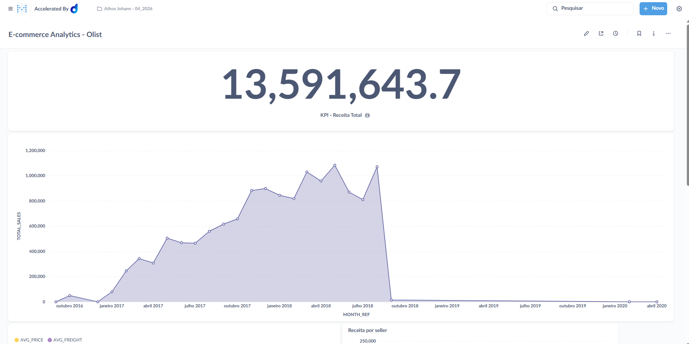
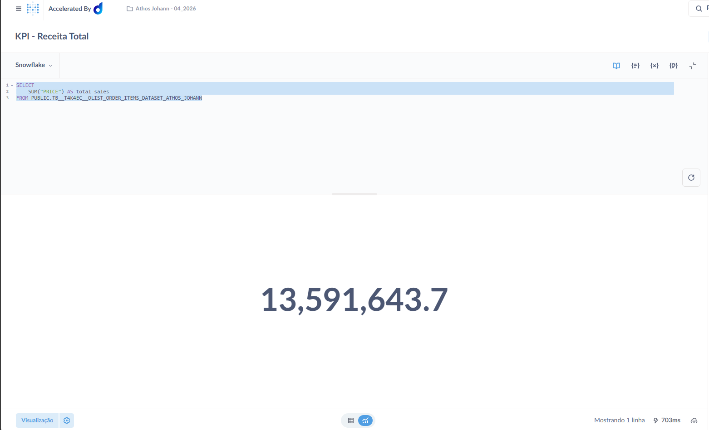
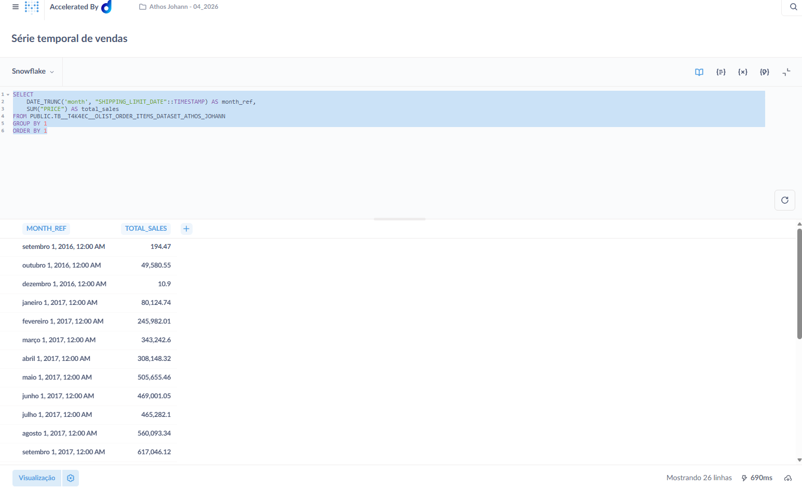
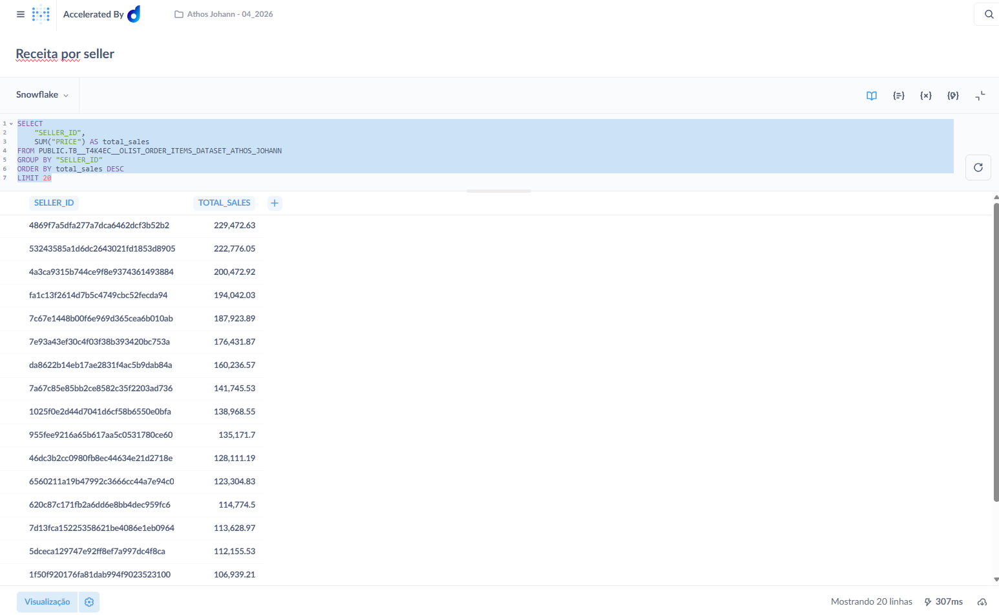
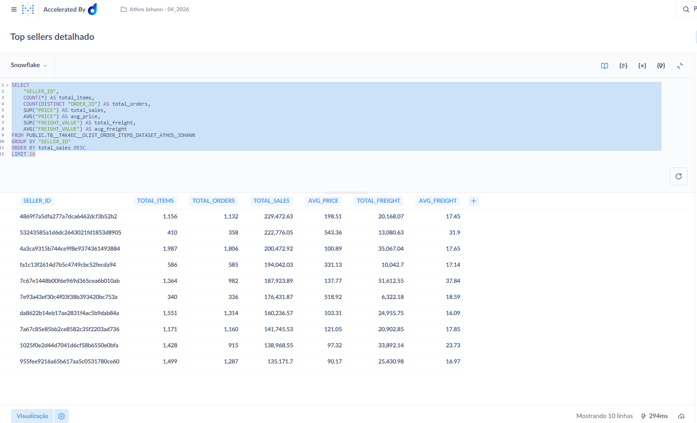
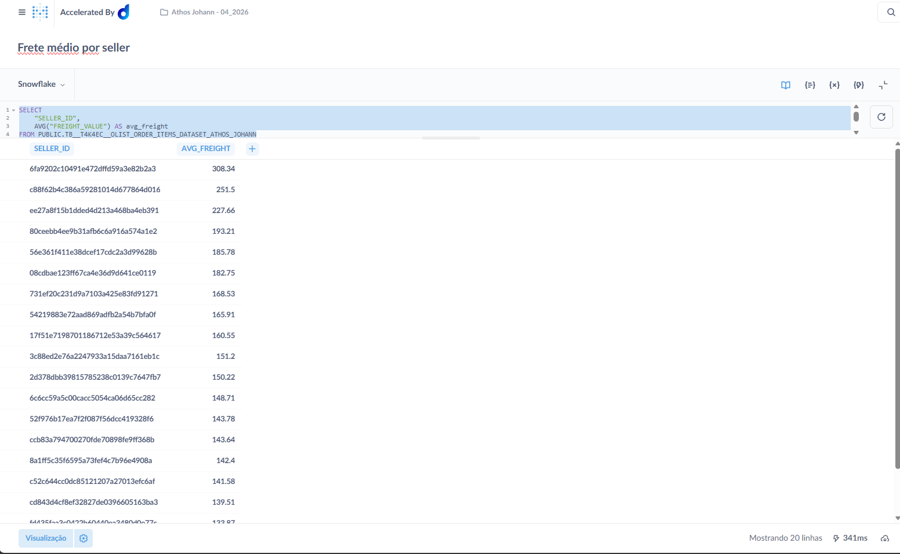
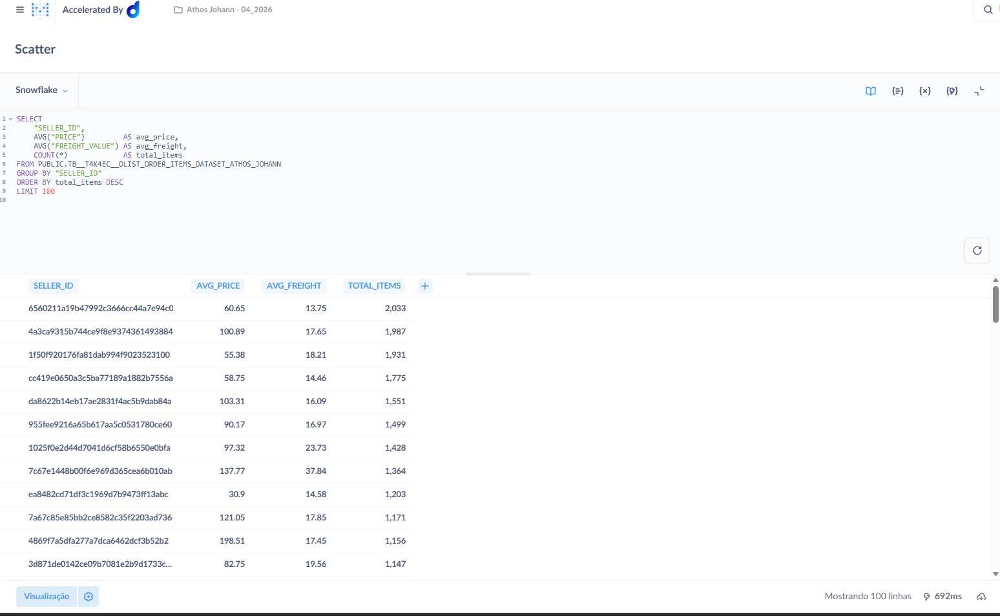
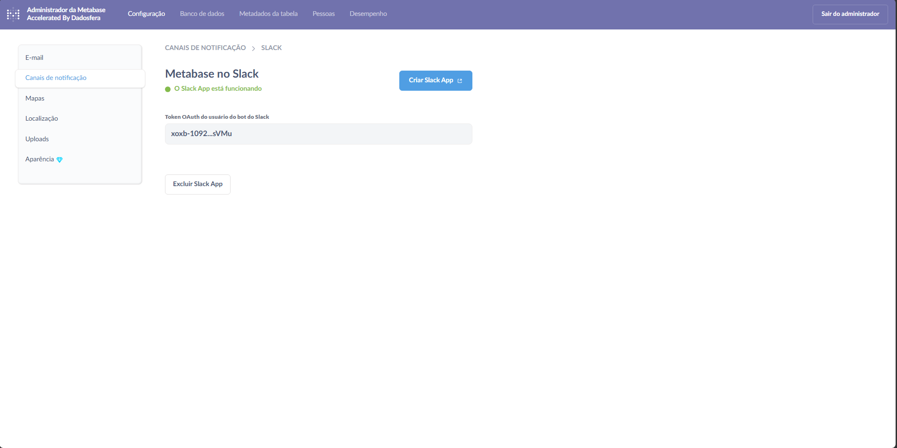

# Item 7 - Análise e Visualização

## Dashboard

**[E-commerce Analytics — Olist](https://metabase-treinamentos.dadosfera.ai/dashboard/295-e-commerce-analytics-olist)**

Dashboard construído no **Metabase** conectado à Dadosfera, sobre a tabela `PUBLIC.TB__T4K4EC__OLIST_ORDER_ITEMS_DATASET_ATHOS_JOHANN`.

## Visualizações

O dashboard contempla 6 cards cobrindo **5 tipos distintos** de visualização:

| # | Card | Tipo | Arquivo SQL |
|---|---|---|---|
| 1 | KPI — Receita Total | Number (métrica única) | [Kpi_receita_total.sql](../sql/item_7/Kpi_receita_total.sql) |
| 2 | Evolução mensal de vendas | Line chart (série temporal) | [serie_temporal_vendas.sql](../sql/item_7/serie_temporal_vendas.sql) |
| 3 | Receita por Seller (Top 20) | Bar chart | [receita_por_seller.sql](../sql/item_7/receita_por_seller.sql) |
| 4 | Top Sellers — visão detalhada | Table | [top_sellers_detalhado.sql](../sql/item_7/top_sellers_detalhado.sql) |
| 5 | Frete médio por Seller (Top 20) | Bar chart | [Frete médio por seller.sql](../sql/item_7/Frete%20médio%20por%20seller.sql) |
| 6 | Preço médio × Frete médio por Seller | Scatter plot | [scatter_preco_vs_frete.sql](../sql/item_7/scatter_preco_vs_frete.sql) |

### Análise temporal

A evolução mensal de vendas usa `DATE_TRUNC('month', SHIPPING_LIMIT_DATE)` para agregar a receita por mês, identificando sazonalidade e tendência do volume ao longo do tempo.

### Scatter plot — Preço médio × Frete médio por Seller

O scatter plota cada seller como um ponto com `avg_price` no eixo X e `avg_freight` no eixo Y, com o tamanho do ponto proporcional ao `total_items`. Permite identificar clusters de sellers com alto preço/baixo frete (premium), baixo preço/alto frete (commodities pesadas) e detectar outliers de precificação.

### Notificação (Metabase Alerts)

Foi configurada uma **notificação automática** no Metabase, enviando alertas para o Slack quando métricas do dashboard atingem limiares definidos — recurso nativo da plataforma para monitoramento proativo de KPIs.

## Evidências

### Visão geral do dashboard

### KPI — Receita Total

### Evolução mensal de vendas (série temporal)

### Receita por Seller

### Top Sellers — visão detalhada

### Frete médio por Seller

### Scatter — Preço médio × Frete médio por Seller

### Notificação configurada no Metabase (Slack)

## Exportação

O dashboard foi exportado em PDF:
[Metabase - E-commerce Analytics - Olist.pdf](../assets/item_7/Metabase%20-%20E-commerce%20Analytics%20-%20Olist.pdf)
