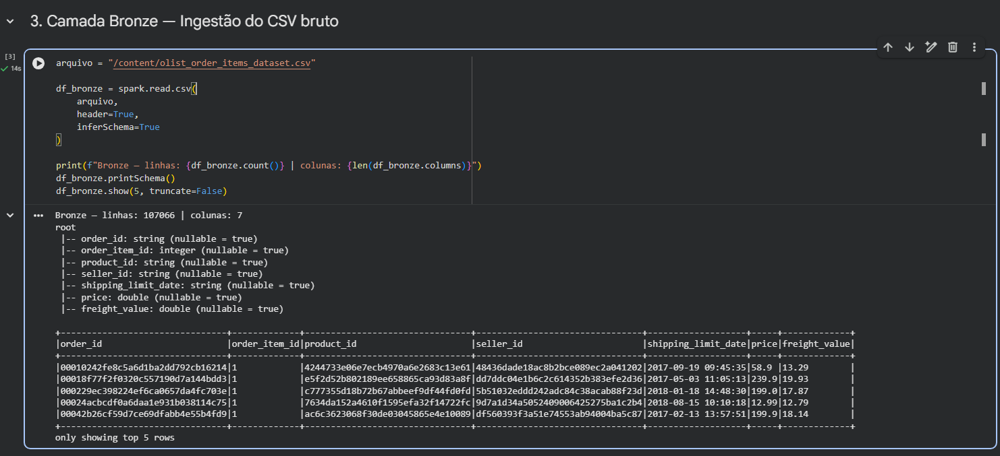
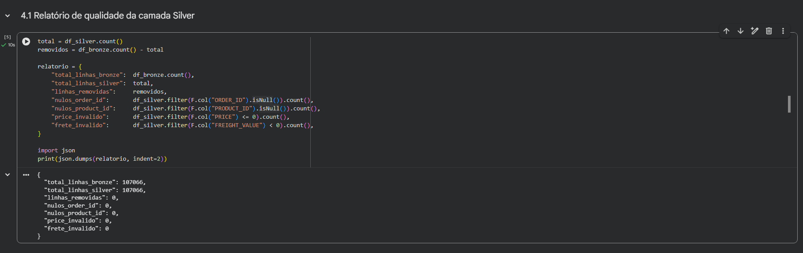
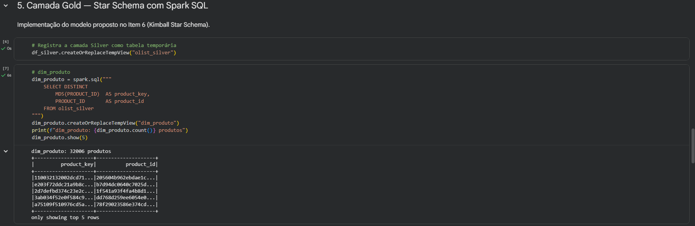
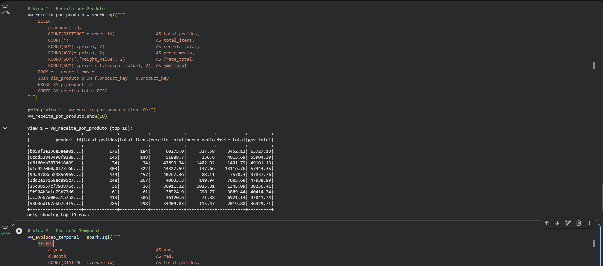

# Item 8 - Pipeline de Dados

## Abordagem

O pipeline foi implementado com **Apache Spark (PySpark)** no Google Colab, cobrindo as etapas de ETL completo — ingestão, limpeza, validação de qualidade e modelagem — sobre o dataset `olist_order_items_dataset`.

A arquitetura segue as camadas **Bronze → Silver → Gold** do Data Warehouse proposto no Item 6, integrando as regras de qualidade do Item 4.

**Notebook:** [notebooks/item_8/Pipeline_ETL_Spark.ipynb](../notebooks/item_8/Pipeline_ETL_Spark.ipynb)

---

## Arquitetura do Pipeline

```
CSV (fonte)
    │
    ▼
[Bronze] ── ingestão bruta com inferSchema
    │
    ▼
[Silver] ── tipagem explícita · filtros de qualidade · deduplicação
    │
    ▼
[Gold] ──── Star Schema (Spark SQL)
             ├── dim_produto
             ├── dim_vendedor
             ├── dim_data
             ├── fct_order_items
             ├── vw_receita_por_produto
             └── vw_evolucao_temporal
```

---

## Etapas do pipeline

### Step 1 — Ingestão (Bronze)

Leitura do CSV com `spark.read.csv(header=True, inferSchema=True)`.

```python
df_bronze = spark.read.csv(arquivo, header=True, inferSchema=True)
```

### Step 2 — Limpeza e Qualidade (Silver)

Mesmas regras de qualidade do Item 4, agora aplicadas via Spark:

| Regra | Implementação Spark |
|---|---|
| Nulos em `ORDER_ID`, `PRODUCT_ID`, `SELLER_ID` | `.filter(F.col(...).isNotNull())` |
| `PRICE` > 0 | `.filter(F.col("PRICE") > 0)` |
| `FREIGHT_VALUE` >= 0 | `.filter(F.col("FREIGHT_VALUE") >= 0)` |
| Deduplicação por `ORDER_ID + ORDER_ITEM_ID` | `.dropDuplicates([...])` |
| Tipagem explícita | `.withColumn(..., F.col(...).cast(...))` |

### Step 3 — Star Schema (Gold)

Criação das dimensões e tabela fato via Spark SQL, conforme modelo Kimball do Item 6:

```python
df_silver.createOrReplaceTempView("olist_silver")

dim_produto    = spark.sql("SELECT DISTINCT MD5(PRODUCT_ID) AS product_key, PRODUCT_ID FROM olist_silver")
dim_vendedor   = spark.sql("SELECT DISTINCT MD5(SELLER_ID)  AS seller_key,  SELLER_ID  FROM olist_silver")
dim_data       = spark.sql("SELECT DISTINCT DATE_FORMAT(SHIPPING_LIMIT_DATE,'yyyyMMdd') AS date_key, ... FROM olist_silver")
fct_order_items = spark.sql("SELECT CONCAT(ORDER_ID,'_',ORDER_ITEM_ID) AS order_item_key, MD5(PRODUCT_ID), ... FROM olist_silver")
```

### Step 4 — Views analíticas

Materialização das duas views definidas no Item 6 via joins Spark SQL:

| View | Descrição |
|---|---|
| `vw_receita_por_produto` | Receita total, GMV, ticket médio e frete por produto |
| `vw_evolucao_temporal` | Evolução mensal de pedidos, itens e receita |

### Step 5 — Exportação

- Views exportadas em **CSV** para evidência
- Tabelas Gold salvas em **Parquet** (formato colunar ideal para analytics)

---

## Bônus: Apache Spark

O uso do **Apache Spark** como engine de processamento justifica-se por:

| Característica | Impacto |
|---|---|
| Processamento distribuído | Escalável para volumes muito superiores a 112k registros |
| Lazy evaluation | Otimização do plano de execução antes de processar |
| Spark SQL | SQL familiar sobre DataFrames distribuídos |
| Formato Parquet | Saída colunar com compressão — padrão de mercado para Data Lakes |

---

## Evidências

### Execução do pipeline — SparkSession e camada Bronze



### Camada Silver — relatório de qualidade



### Camada Gold — tabelas do Star Schema



### Views analíticas


