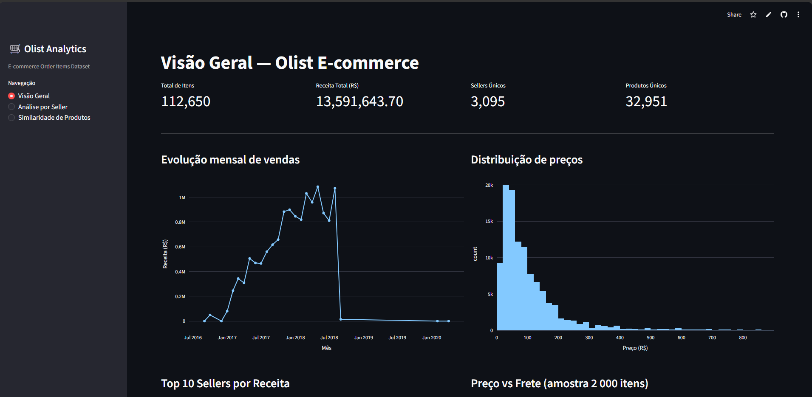
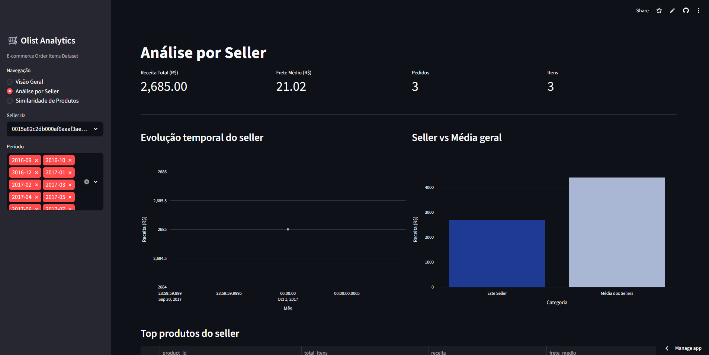
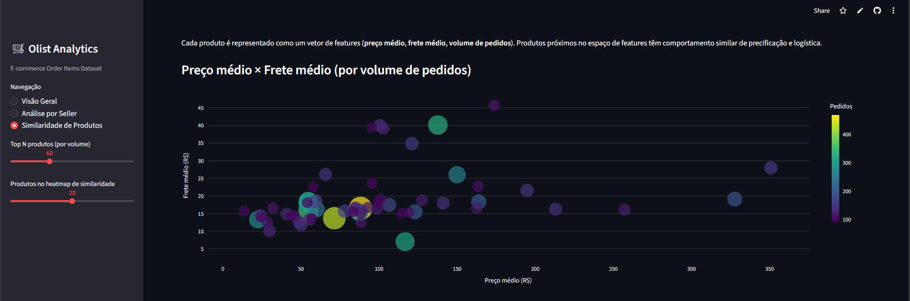
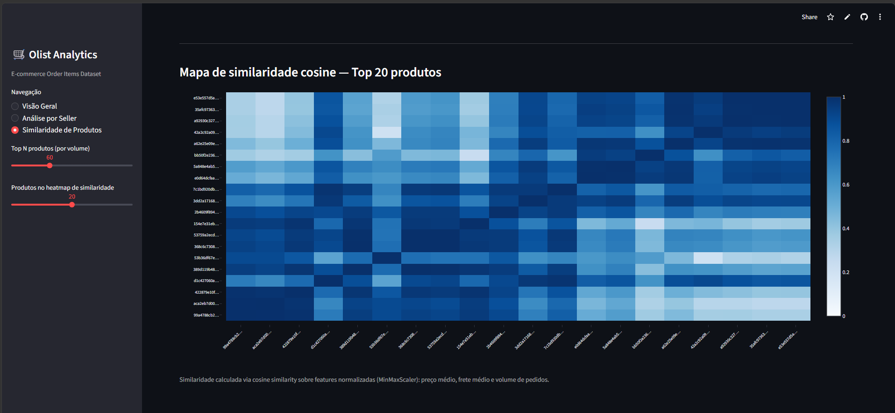

# Item 9 - Data App com Streamlit

## Aplicação

Data App desenvolvido com **Streamlit** para exploração interativa dos dados de `olist_order_items_dataset`, cobrindo EDA geral, análise por seller e similaridade entre produtos.

**Código-fonte:** [item_9_data_app/app.py](../item_9_data_app/app.py)

## Páginas do app

### 1. Visão Geral

EDA completa sobre toda a base:

| Visualização | Tipo |
|---|---|
| KPIs: total de itens, receita, sellers únicos, produtos únicos | Metric cards |
| Evolução mensal de vendas | Line chart (Plotly) |
| Distribuição de preços | Histogram (Plotly) |
| Top 10 sellers por receita | Bar chart (Plotly) |
| Preço vs Frete — amostra 2.000 itens com linha de tendência | Scatter + OLS trendline |

### 2. Análise por Seller

Exploração focada em um seller específico, com filtros interativos por ID e período:

| Visualização | Tipo |
|---|---|
| KPIs individuais: receita, frete médio, pedidos, itens | Metric cards |
| Evolução temporal do seller | Line chart |
| Comparação receita do seller vs média geral | Bar chart comparativo |
| Top produtos do seller | Tabela interativa |
| Dados detalhados | Dataframe expansível |

### 3. Similaridade de Produtos

Análise de similaridade entre produtos usando features numéricas:

- **Feature vector por produto:** `avg_price`, `avg_freight`, `total_orders`
- **Normalização:** MinMaxScaler
- **Métrica:** Cosine Similarity

| Visualização | Tipo |
|---|---|
| Distribuição dos produtos no espaço de features | Scatter (tamanho = volume, cor = pedidos) |
| Similaridade entre top N produtos | Heatmap de cosine similarity |

## Stack técnica

| Biblioteca | Uso |
|---|---|
| `streamlit` | Framework do app |
| `pandas` | Manipulação dos dados |
| `plotly` | Visualizações interativas |
| `scikit-learn` | `MinMaxScaler` + `cosine_similarity` |
| `statsmodels` | Linha de tendência OLS no scatter |

## Estrutura de arquivos

```
item_9_data_app/
├── app.py
├── requirements.txt
└── data/
    └── olist_order_items_dataset.csv
```

## Deploy no Streamlit Community Cloud

1. Acesse [share.streamlit.io](https://share.streamlit.io)
2. Conecte o repositório GitHub `ATHOS_JOHANN_DDF_TECH_042026`
3. Branch: `main` | Main file path: `item_9_data_app/app.py`
4. Clique em **Deploy**

## Evidências

### Visão Geral



### Análise por Seller



### Similaridade de Produtos — Scatter



### Similaridade de Produtos — Heatmap


