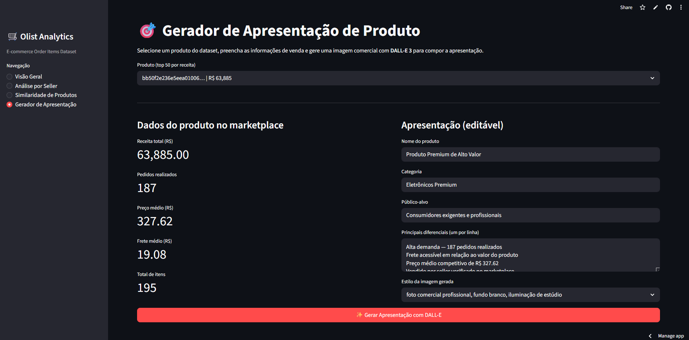
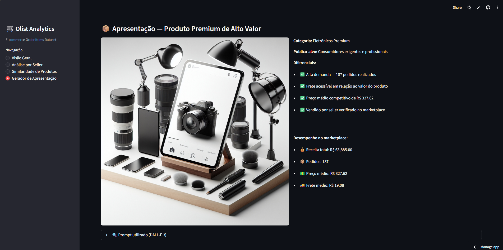

# Item Bônus — GenAI + Data App (Gerador de Apresentação de Produto)

## Solução

Extensão do Data App do Item 9 com uma nova página **"Gerador de Apresentação"**, que combina:

- Dados reais do produto no marketplace (receita, pedidos, preço médio, frete)
- Informações de venda fornecidas pelo usuário (nome, categoria, público, diferenciais)
- Imagem gerada via **DALL-E 3 (OpenAI)** com base num prompt estruturado

**App publicado:** [athosjohannddftech042026.streamlit.app](https://athosjohannddftech042026-bhnzunzfetvedwqddt4qnz.streamlit.app/)

**Código-fonte:** [item_9_data_app/app.py](../item_9_data_app/app.py)

**Notebook de prompts:** [notebooks/item_bonus/GenAI_Product_Presentation.ipynb](../notebooks/item_bonus/GenAI_Product_Presentation.ipynb)

---

## Funcionamento

1. Usuário seleciona um produto (top 50 por receita no dataset)
2. App exibe as métricas do produto: receita, pedidos, preço médio, frete médio
3. Usuário preenche: nome do produto, categoria, público-alvo, diferenciais e estilo de imagem
4. DALL-E 3 gera a imagem com base no prompt estruturado
5. App monta a apresentação: imagem + métricas + diferenciais

---

## Estrutura do prompt

```
Professional e-commerce product image: {nome_produto}, {categoria}.
{estilo_visual}.
High quality, commercial photography style, suitable for online marketplace.
No text or watermarks.
```

### Estilos disponíveis

| Estilo | Caso de uso ideal |
|---|---|
| Foto comercial — fundo branco, iluminação estúdio | Catálogos e marketplaces |
| Lifestyle moderno, ambiente clean e minimalista | Redes sociais e campanhas |
| Flat lay elegante sobre superfície de mármore | Produtos de beleza e moda |
| Renderização 3D realista, fundo gradiente | Eletrônicos e tecnologia |

---

## Prompts documentados

Foram testados e documentados 4 prompts no notebook, cobrindo os 4 estilos:

| # | Produto exemplo | Estilo | Resultado |
|---|---|---|---|
| 1 | Fone de Ouvido Bluetooth Premium | Fundo branco comercial | Alta fidelidade para marketplace |
| 2 | Mochila Executiva Impermeável | Lifestyle minimalista | Ideal para redes sociais |
| 3 | Kit Skincare Facial | Flat lay mármore | Elegante para produtos de beleza |
| 4 | Smartwatch Esportivo | Renderização 3D | Impactante para eletrônicos |

---

## Configuração da API Key

No Streamlit Cloud: **Settings → Secrets** → adicionar:

```toml
OPENAI_API_KEY = "sk-..."
```

---

## Evidências

### Página do Gerador de Apresentação



### Apresentação gerada (imagem + métricas)



### Prompt utilizado (expandido no app)


